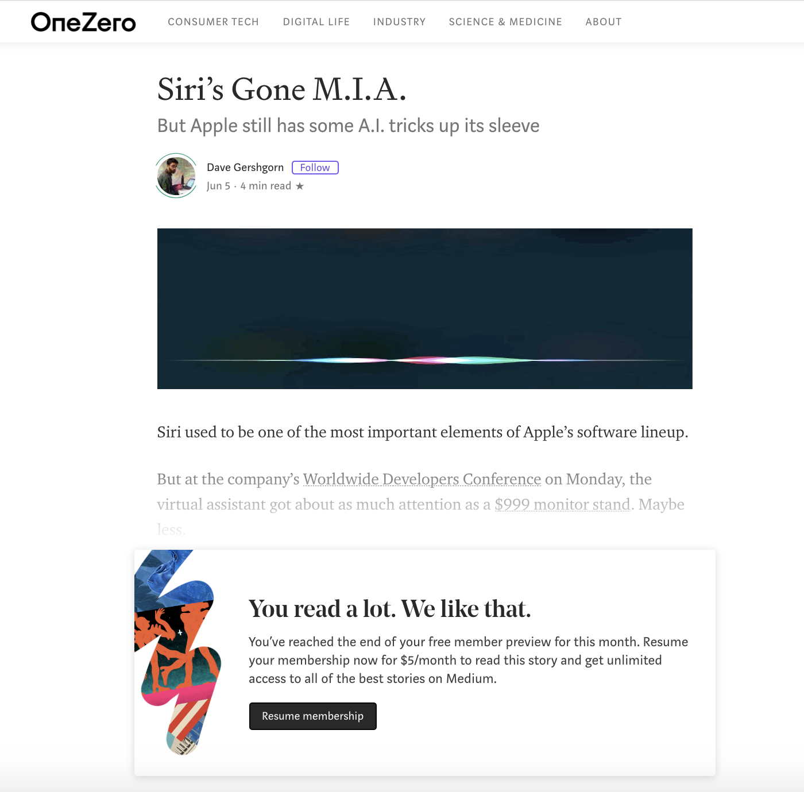
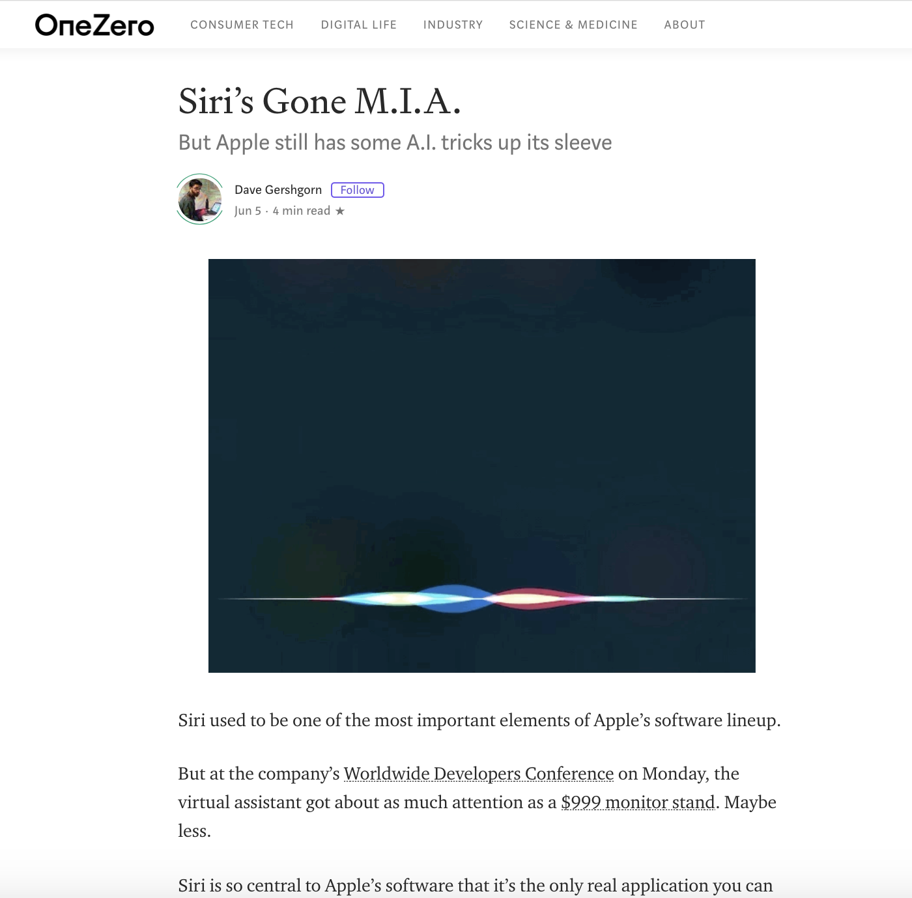

# Mediumship

📚 Mediumship is a browser extension that lets you try Medium with membership-features, allowing you to read all Medium stories for free.

Before | After
:---:|:---:
 | 

>This is a forked version with:
> - Removed Firefox version.
> - Some code refactorings.
> - Modifications to the supported list of medium domains.
> - A new icon.

## Installation

1. [Clone](https://github.com/ni554n/mediumship.git) this repo or [Download](https://github.com/ni554n/mediumship/archive/master.zip) as zip and extract it somewhere permanent.
2. Go to [Chrome Extensions](chrome://extensions/) and enable *Developer Mode*.
3. Click *Load Unpacked* button and select the _**mediumship-master/extension/**_ from extracted folder.

## Usage

This is an install-and-forget extension. It automatically unlocks Medium articles in the background, without requiring any user intervention.

*P.S. If it doesn't work, sign out of Medium and refresh the page!*

## Disclaimer

This is an extension that demonstrates the ability to modify HTTP request headers to twitter url. Use it at your own risk! The same result can be achieved by the following ways without the extension:

- Use another device
- Use your browser's incognito mode
- Paste a url on your twitter textbox, select it and right-click `go to link`.

This extension modifies the HTTP request header referrer as mentioned [here](https://twitter.com/ev/status/1100899021621583872).
